Workshop to learn the basics of AWS and Terraform while deploying a small serverless application.

- [Login to the AWS Console](#login-to-the-aws-console)
- [Start a session in the EC2 instance](#start-a-session-in-the-ec2-instance)
- [Install Terraform](#install-terraform)
- [Get a copy of the initial code](#get-a-copy-of-the-initial-code)
- [Terraform 101](#terraform-101)
  - [init](#init)
  - [validate](#validate)
  - [plan](#plan)
  - [apply](#apply)
  - [Verify in the AWS Console](#verify-in-the-aws-console)
- [Terraform 102](#terraform-102)
  - [Modify the deployment](#modify-the-deployment)
  - [Destroy the deployment](#destroy-the-deployment)
  - [Apply or destroy without waiting for confirmation](#apply-or-destroy-without-waiting-for-confirmation)
- [Application](#application)
  - [First deployment: Lambda](#first-deployment-lambda)
  - [Storing the results in an Amazon S3 Bucket](#storing-the-results-in-an-amazon-s3-bucket)
  - [Automating the execution of the Lambda function with EventBridge](#automating-the-execution-of-the-lambda-function-with-eventbridge)
  - [Notifying the users when the execution completes](#notifying-the-users-when-the-execution-completes)
  - [Remove all hardcoded values and turn them into variables](#remove-all-hardcoded-values-and-turn-them-into-variables)
- [More Terraform concepts](#more-terraform-concepts)
- [Automating deployments with GitHub and GitLab](#automating-deployments-with-github-and-gitlab)


 The application we'll build

A mission team runs a periodic ‘launch window check’. The check evaluates a few constraints (wind, clouds, lightning, range status) against thresholds and outputs GO / NO-GO. The result is stored in S3 as an audit artifact, and the team gets an email when the run completes.

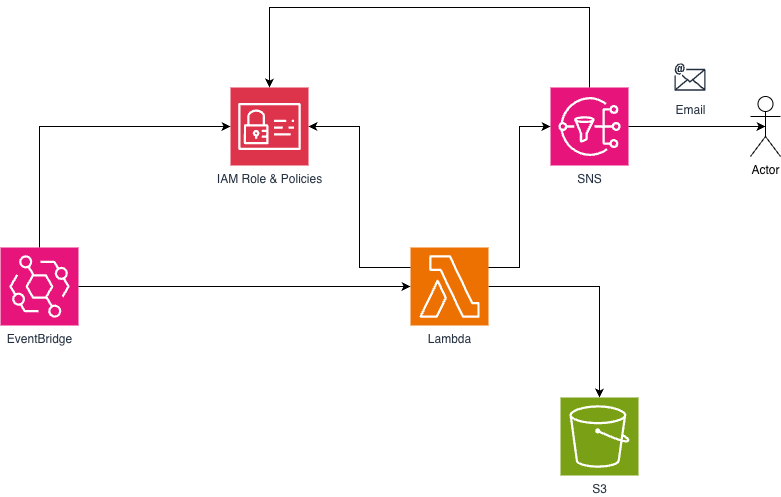


 Set up your environment 

# Login to the AWS Console 
* Login into the Console with the credentials provided.
* Go to EC2 and locate the instance with your name.


# Start a session in the EC2 instance 
Select the instance and click `Connect`. 
Session Manager should be enabled and should allow you to connect.

Once inside the instance, make sure you are in the $HOME directory:

```console
    cd $HOME
```


# Install Terraform

See [INSTALL.md](./doc/INSTALL.md)


# Get a copy of the initial code
For the purpose of this Workshop, the code is located in an Amazon S3 Bucket. Copy it to the EC2 running this command:
(Terraform code can be directly executed from a GitHub or GitLab repo, more on that if time allows)

```console
    aws s3 cp s3://aws-terraform-workshop/workshopsrc.zip .    
```

And then unzip the file:
```console
    unzip workshopsrc.zip .
```

**Repo structure**

```
.
├── main.tf
├── provider.tf
└── lambda
    └── handler.py
```

Open the file `main.tf`:

```console
vi main.tf
```

Click `I` to enter edition mode, and in the line `name_prefix`, set the value to your name:

```hcl
locals {
  name_prefix  = "yourname"   <--- HERE
  project_name = "launch-window-by-${local.name_prefix}"
}
```

Press `ESC` and then type `:w!` and press `ENTER` to write the changes.
Then type `:q` and press `ENTER` to quit the editor.


# Terraform 101

## init

The `terraform init` command initializes a working directory containing configuration files and installs plugins for required providers.

```console
    terraform init
```

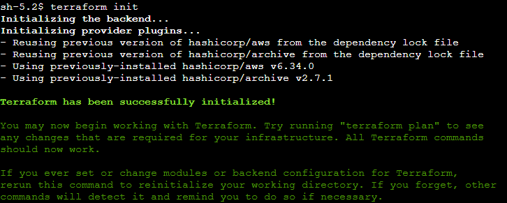


## validate

The terraform validate command validates the configuration files in a directory. It does not validate remote services, such as remote state or provider APIs.

```console
    terraform validate
```

## plan

The `terraform plan` command creates an execution plan with a preview of the changes that Terraform will make to your infrastructure.

```console
    terraform plan
```

## apply

The `terraform apply` command executes the actions proposed in a Terraform plan to create, update, or destroy infrastructure.

```console
    terraform apply
```

Type `yes` when asked for confirmation and wait for the code to deploy.


## Verify in the AWS Console

Go to the AWS Console and search for the Lambda function.


# Terraform 102

## Modify the deployment

Go back to the ``main.tf`` file and change the name of your function.

Before applying any change, run a plan to verify that only the name will be changed:

```console
    terraform plan
```

And if everything looks good, apply the changes:

```console
    terraform apply
```

## Destroy the deployment

```console
    terraform destroy
```

Which is the equivalent of:


```console
    terraform apply -destroy
```

## Apply or destroy without waiting for confirmation
Add the ``-auto-approve`` option:


```console
    terraform apply -auto-approve
```


# Application 

## First deployment: Lambda

The code base is setup to deploy a Lambda function called `launch-window`.

Once the `apply` completes, go to the `AWS Console --> Lambda --> Functions` and find your Lambda. 

Create a new Test Event in order to execute the function.


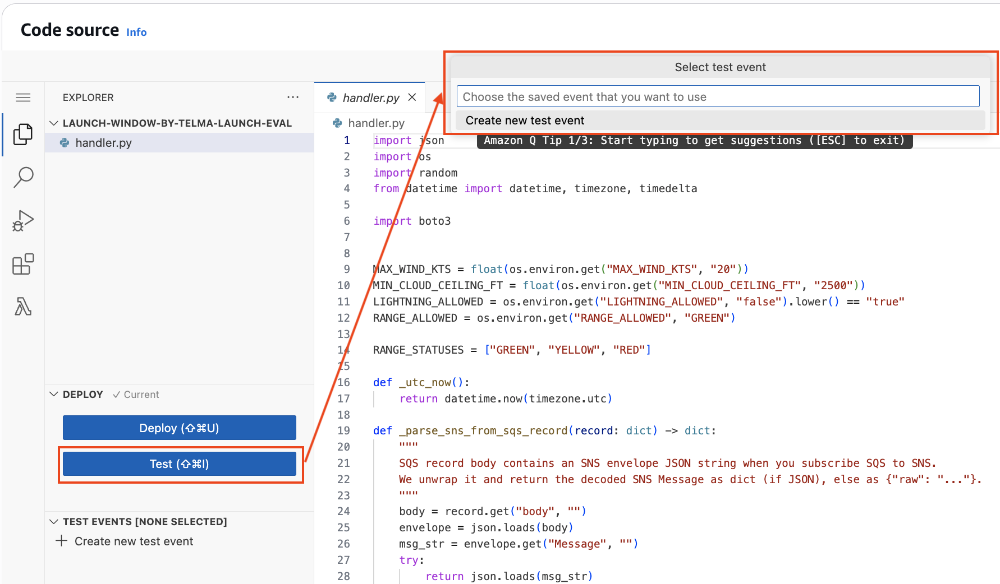

Assign a name to the test:


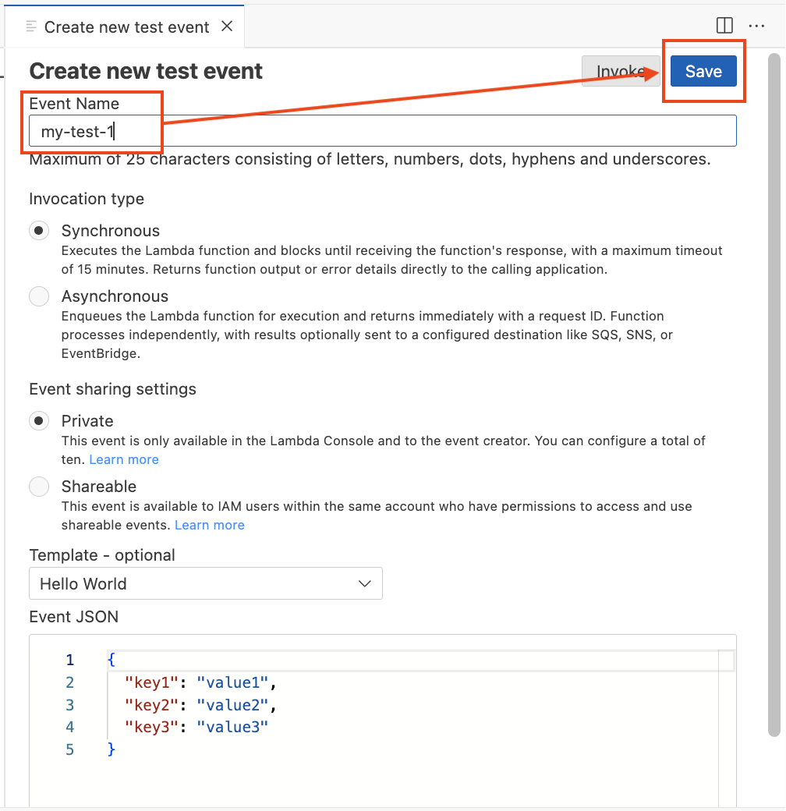


For this application, there is no need to change the content of the JSON given by default, since the function won't use it.

Click `Save` and then click `Invoke`.

Verify the function executes successfully.

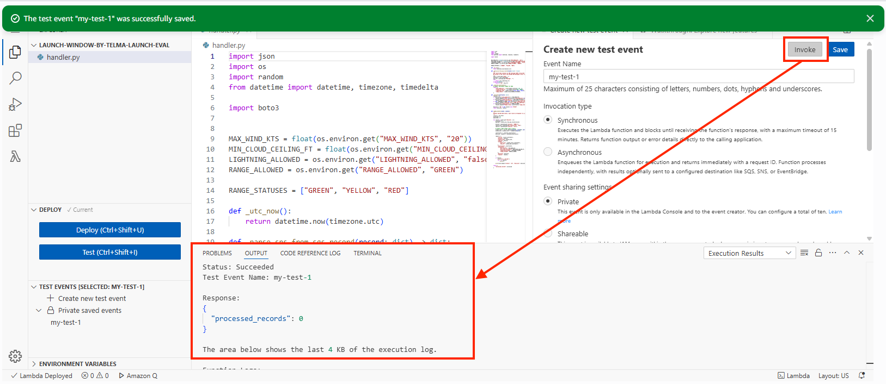


Another way to verify this, is to open its CloudWatch log. In the tab `Monitor`, click `View CloudWatch logs`. It will open a new window.

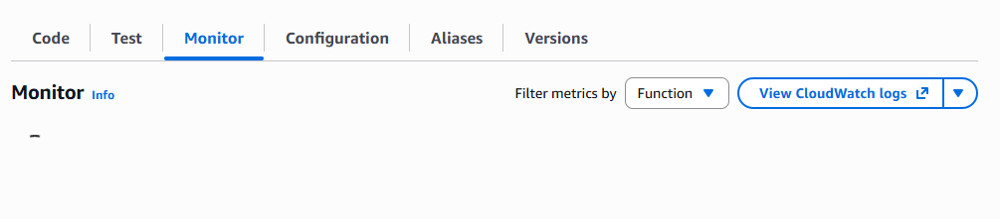


It will show the Lambda's CloudWatch LogGroup, with a list of logs: one for each execution.


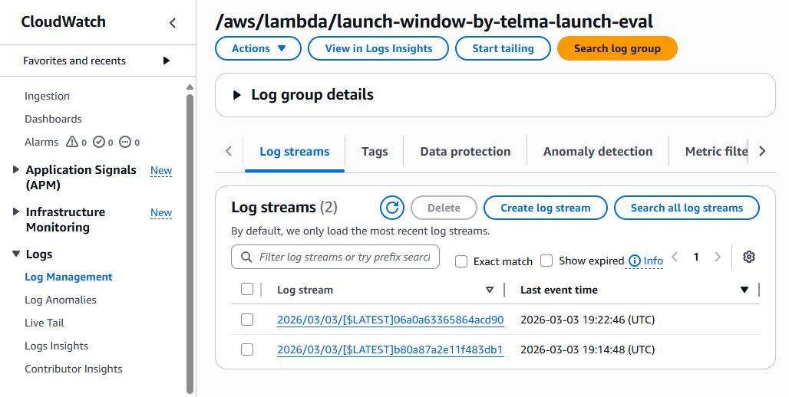


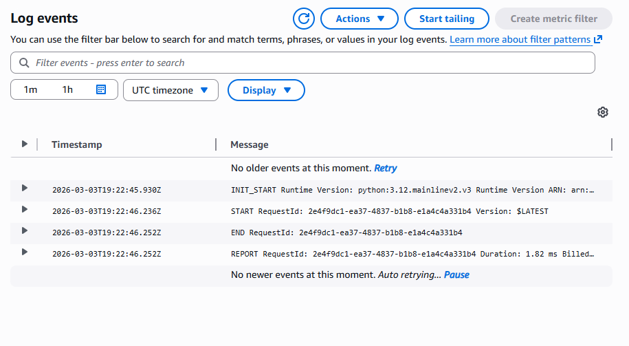


## Storing the results in an Amazon S3 Bucket 

Now let's add an Amazon S3 Bucket where the Lambda function can store the results.

Open the file `terraform --> lambda --> handler.py` file and remove the comments for the following pieces:

* `s3 = boto3.client("s3")` 
* `ARTIFACT_BUCKET = os.environ["ARTIFACT_BUCKET"]`
* `ARTIFACT_PREFIX = os.environ.get("ARTIFACT_PREFIX", "launch-window")`
* `def _artifact_key(run_dt: datetime, mission: str)` (uncomment the entire method)
* Lines 105 - 114

Save the changes.

Now open the `main.tf` file and add this block:

```hcl 
# -----------------------------
# S3 bucket for audit artifacts
# -----------------------------
resource "aws_s3_bucket" "artifacts" {
    bucket = lower("${local.name_prefix}-artifacts")
}
```

Then, find the place where the Lambda's environment variables are defined, remove the "TBD" string for `ARTIFACT_BUCKET` and replace it with the commented line next to it:

From:
```hcl
ARTIFACT_BUCKET          = "TBD"  #aws_s3_bucket.artifacts.bucket
```

To:
```hcl
ARTIFACT_BUCKET          = aws_s3_bucket.artifacts.bucket
```


Save the changes and re-deploy the solution:

```console
    terraform apply -auto-approve
```

Wait until it completes, go back to the Console, and verify the changes are there:
* A new S3 bucket has been created
* The Lambda code contains the new block 
 
Re-test the function.


:x: It fails

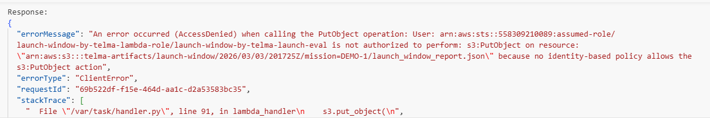


> [!CAUTION] 
> **Why it failed**
> 
> It failed because, even though Lambda can interact well with S3, it needs the permissions to do it.
    AWS follows the principle of least privilege: every resource (user, bucket, function, etc.), by default, 
    has no permissions to invoke another or perform changes. Any action must be explicitly allowed.
    To make this happen, AWS uses `IAM Roles` and `IAM Policies`. We already created one for the Lambda function.


Go to the Terraform repo and open the file `terraform --> main.tf` 

Find the block `data "aws_iam_policy_document" "lambda_policy"` and add this block of code:


```hcl 
statement {
    effect = "Allow"
    actions = [
        "s3:PutObject"
    ]
    resources = ["${aws_s3_bucket.artifacts.arn}/*"]
}
```

This block will allow the Lambda function to add objects to the new bucket (and only that bucket). 
The function won't be allowed to Read or Delete objects, only add new ones.


The entire block should look like this:

```hcl 
data "aws_iam_policy_document" "lambda_policy" {
    statement {
        effect = "Allow"
        actions = [
        "logs:CreateLogGroup",
        "logs:CreateLogStream",
        "logs:PutLogEvents"
        ]
        resources = ["*"]
    }

    statement {
        effect = "Allow"
        actions = [
        "s3:PutObject"
        ]
        resources = ["${aws_s3_bucket.artifacts.arn}/*"]
    }
}
```


Save the changes and re-deploy:


```console
    terraform apply -auto-approve
```

Go to the console and re-test the Lambda.

Once it completes, find the S3 bucket and verify a file has been created.


## Automating the execution of the Lambda function with EventBridge

The solution works great, but it requires a person to execute it on demand.

We'll add an Event Bridge schedule that will execute the function every 5 minutes.

Open the `main.tf` file and add this block:

```hcl 
# -----------------------------
# EventBridge 
# -----------------------------
resource "aws_scheduler_schedule" "rule" {
  name                = "launch-schedule"
  group_name = "default"

  flexible_time_window {
    mode = "OFF"
  }

  schedule_expression = "rate(5 minutes)"  Or use an event_pattern

  target {
    arn      = aws_lambda_function.launch_eval.arn
    role_arn = aws_iam_role.schedule_role.arn
  }
}

resource "aws_lambda_permission" "allow_eventbridge_to_invoke_lambda" {
  statement_id  = "AllowEventBridgeInvocation"
  action        = "lambda:InvokeFunction"
  function_name = aws_lambda_function.launch_eval.function_name
  principal     = "events.amazonaws.com"
  source_arn    = aws_scheduler_schedule.rule.arn
}


resource "aws_iam_role" "schedule_role" {
  name = "${local.project_name}-schedule-role"

  assume_role_policy = jsonencode({
    Version = "2012-10-17"
    Statement = [{
      Effect = "Allow"
      Principal = { Service = "scheduler.amazonaws.com" }
      Action = "sts:AssumeRole"
    }]
  })
}

data "aws_iam_policy_document" "schedule_policy" {
  statement {
    effect = "Allow"
    actions = [
      "lambda:InvokeFunction"
    ]
    resources = [aws_lambda_function.launch_eval.arn]
  }
}

resource "aws_iam_role_policy" "schedule_inline" {
  name   = "${local.project_name}-schedule-policy"
  role   = aws_iam_role.schedule_role.id
  policy = data.aws_iam_policy_document.schedule_policy.json
}
```

Save the changes and re-deploy:


```console
    terraform apply -auto-approve
```

 Go to the console and open `EventBridge`. Find your schedule.

 You can wait for the 5 mins to pass.

 One way to validate the Lambda has been executed is looking at `CloudWatch logs`:


## Notifying the users when the execution completes

Now let's add a notification when the Lambda finishes, sending the results to an e-mail address.

Open the file `terraform --> lambda --> handler.py` file and remove the comments for the following pieces:

* `sns = boto3.client("sns")` 
* `DONE_TOPIC_ARN = os.environ["DONE_TOPIC_ARN"]`
* Lines 119 - 169

Save the changes.

Now open the `main.tf` file and add this block (make sure to update your e-mail address):

```hcl 
# -----------------------------
# SNS Topic
# -----------------------------
resource "aws_sns_topic" "done" {
    name = "${local.name_prefix}-done"
}

 Email subscriptions (require confirmation by clicking link in email)    
resource "aws_sns_topic_subscription" "done_email" {
    topic_arn = aws_sns_topic.done.arn
    protocol  = "email"
    endpoint  = "your@email.com"    <-- CHANGE TO YOUR E-MAIL
}
```


Then, find the place where the Lambda's environment variables are defined, remove the "TBD" string for `DONE_TOPIC_ARN` and replace its value with the commented one:

From:
```hcl
DONE_TOPIC_ARN           = "TBD" #aws_sns_topic.done.arn
```

To:
```hcl
DONE_TOPIC_ARN           = aws_sns_topic.done.arn
```

Also, let's make sure the Lambda will have the required permissions to publish messages to this new topic.
In the block ``data "aws_iam_policy_document" "lambda_policy"``, add the `sns:Publish` permission:

```hcl 
    statement {
        effect = "Allow"
        actions = [
        "sns:Publish"
        ]
        resources = [aws_sns_topic.done.arn]
    }
```

The entire block will look like this:

```hcl 
data "aws_iam_policy_document" "lambda_policy" {
    statement {
        effect = "Allow"
        actions = [
        "logs:CreateLogGroup",
        "logs:CreateLogStream",
        "logs:PutLogEvents"
        ]
        resources = ["*"]
    }

    statement {
        effect = "Allow"
        actions = [
        "s3:PutObject"
        ]
        resources = ["${aws_s3_bucket.artifacts.arn}/*"]
    }

    statement {
        effect = "Allow"
        actions = [
        "sns:Publish"
        ]
        resources = [aws_sns_topic.done.arn]
    }
}
```

Save the changes and re-deploy:

```console
    terraform apply -auto-approve
```

Wait until it completes, go back to the Console, and verify the changes are there:
* A new SNS topic has been created (search for `SNS` or `Simple Notification Service`, click on `Topics`)
* The SNS topic has a subscriber with your e-mail
* You got an e-mail asking to confirm to the subscription (remember to confirm the subscription in order to get the notifications)
* The Lambda code contains the new block


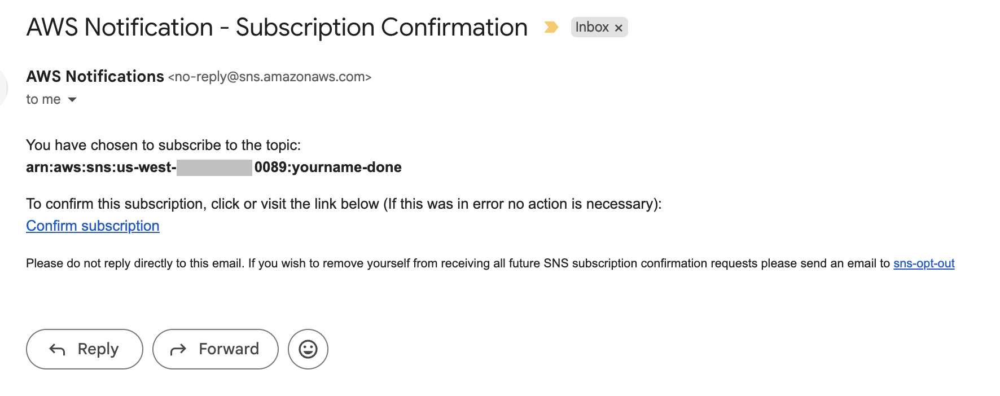


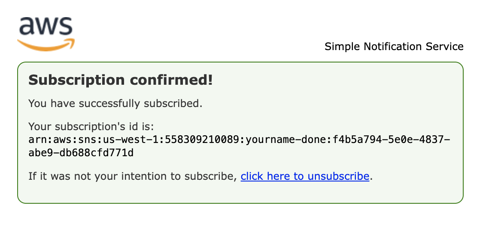

 
Re-test the function, or wait for EventBridge to trigger it.


:partying_face: **DONE!**


## Remove all hardcoded values and turn them into variables

Hardcoded values are always bad practice.

Create a file named `variables.tf`:

```command
vi variables.tf
```
Press `I` to enter edition mode, and paste this code inside:

```hcl 
variable "max_wind_kts" {
  description = "Maximum allowable wind speed (knots) for GO decision"
  type        = number
  default     = 20
}

variable "min_cloud_ceiling_ft" {
  description = "Minimum allowable cloud ceiling (feet) for GO decision"
  type        = number
  default     = 2500
}

variable "lightning_allowed" {
  description = "Whether lightning risk is allowed for GO decision"
  type        = bool
  default     = false
}

variable "range_allowed" {
  description = "Allowed range status for GO decision (GREEN only in this workshop)"
  type        = string
  default     = "GREEN"
}


variable "done_email" {
  description = "Email address to subscribe to completion SNS topic (requires confirmation)"
  type        = string
  default     = "your@email.com"
}

variable "schedule_expression" {
  description = "EventBridge schedule expression (e.g., rate(5 minutes) or cron(...))"
  type        = string
  default     = "rate(5 minutes)"
}
```


Now we'll replace all our hardcoded values for these variables in `main.tf`:

Inside the definition of the Lambda function (`resource "aws_lambda_function" "launch_eval"`):

```hcl 
  environment {
    variables = {
      ARTIFACT_BUCKET          = aws_s3_bucket.artifacts.bucket
      DONE_TOPIC_ARN           = aws_sns_topic.done.arn
      MAX_WIND_KTS             = tostring(var.max_wind_kts)
      MIN_CLOUD_CEILING_FT     = tostring(var.min_cloud_ceiling_ft)
      LIGHTNING_ALLOWED        = tostring(var.false)
      RANGE_ALLOWED            = var.range_allowed
      ARTIFACT_PREFIX          = "launch-window"
    }
  }

```


# More Terraform concepts

See [TERRAFORM.md](./doc/TERRAFORM.md)


# Automating deployments with GitHub and GitLab


