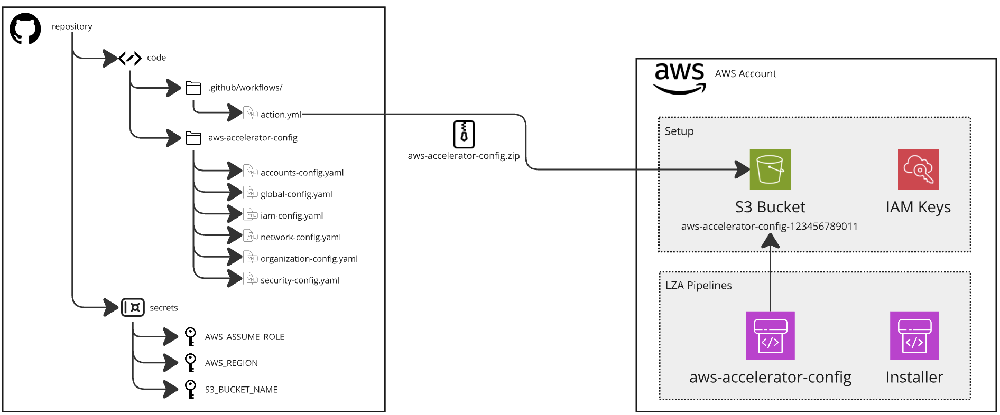
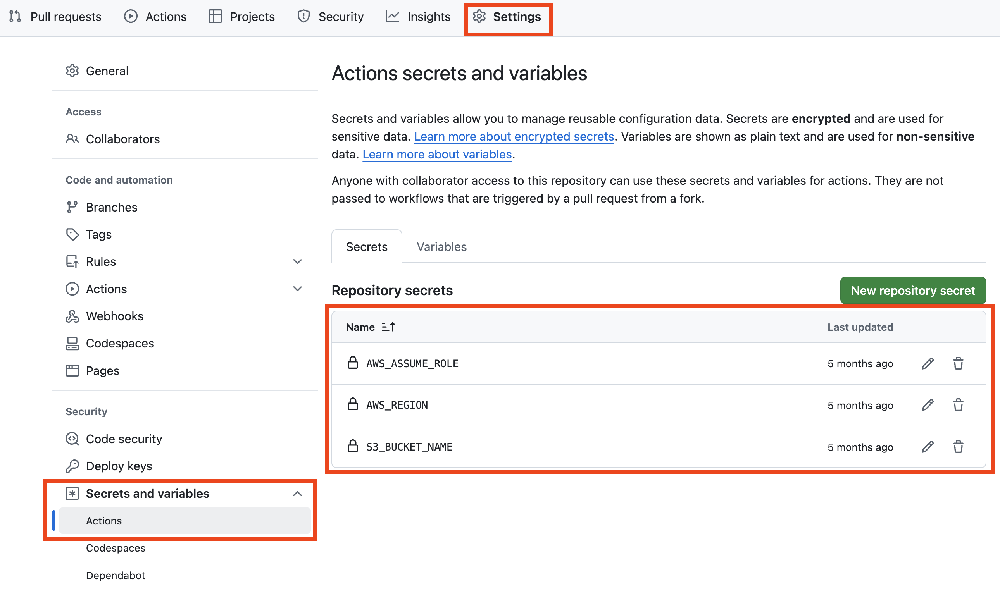

- [GitHub Actions](#github-actions)
  - [IAM Role](#iam-role)
  - [GitHub Repo](#github-repo)
- [GitLab CI/CD](#gitlab-cicd)
  - [IAM Role](#iam-role-1)
  - [GitLab Repo configuration](#gitlab-repo-configuration)


# GitHub Actions

## IAM Role
In the AWS Management account, create an IAM Role for GitHub to access the account.

The role should have the following permissions:
1. sts:AssumeRole
2. ecr:GetAuthorizationToken
3. s3:putObject

```yaml
{
    "Version": "2012-10-17",
    "Statement": [
        {
            "Sid": "Statement1",
            "Effect": "Allow",
            "Action": [
                "sts:AssumeRole"
            ],
            "Resource": [
                "<IAM_ROLE_ARN>"
            ]
        },
        {
            "Sid": "AllowGitHubActionsGetAuthTOken",
            "Effect": "Allow",
            "Action": [
                "ecr:GetAuthorizationToken"
            ],
            "Resource": [
                "*"
            ]
        },
        {
            "Sid": "AllowUploadToS3",
            "Effect": "Allow",
            "Action": [
                "s3:PutObject"
            ],
            "Resource": [
                "*"
            ]
        }
    ]
}
```

And the following trust policy:

```yaml
{
    "Version": "2008-10-17",
    "Statement": [
        {
            "Effect": "Allow",
            "Principal": {
                "Federated": "arn:aws:iam::<AWS_ACCOUNT_ID>:oidc-provider/token.actions.githubusercontent.com"
            },
            "Action": "sts:AssumeRoleWithWebIdentity",
            "Condition": {
                "StringEquals": {
                    "token.actions.githubusercontent.com:aud": "sts.amazonaws.com"
                },
                "StringLike": {
                    "token.actions.githubusercontent.com:sub": "repo:<YOUR_GITHUB_USER>/<YOUR_GITHUB_REPO>:*"
                }
            }
        }
    ]
}
```

## GitHub Repo




1. Create a repo in GitHub
2. Store 3 secrets under Settings > Secrets and variables > Actions:
   * AWS_ASSUME_ROLE (stores the ARN of the Role created previously)
   * AWS_REGION (name of the region, i.e. us-east-1)
   * S3_BUCKET_NAME (name of the S3 bucket where the zip file will be uploaded)




3. Store the code in the repo inside a specific folder, like `source` or `src`.
4. Create the file `.github/workflows/action.yml` with the following contents:

```yaml
name: Terraform Deploy

on:
  push:
    branches: [main]

env:
  AWS_REGION: us-east-1
  TF_VERSION: 1.6.0

jobs:
  terraform:
    name: Terraform
    runs-on: ubuntu-latest
    permissions:
      id-token: write
      contents: read
    
    steps:
      - name: Checkout
        uses: actions/checkout@v4

      - name: Configure AWS Credentials
        uses: aws-actions/configure-aws-credentials@v4
        with:
          role-to-assume: ${{ secrets.AWS_ROLE_ARN }}
          aws-region: ${{ env.AWS_REGION }}

      - name: Setup Terraform
        uses: hashicorp/setup-terraform@v3
        with:
          terraform_version: ${{ env.TF_VERSION }}

      - name: Terraform Format
        run: terraform fmt -check
        working-directory: ./src
        continue-on-error: true

      - name: Terraform Init
        run: terraform init
        working-directory: ./src

      - name: Terraform Validate
        run: terraform validate
        working-directory: ./src

      - name: Terraform Plan
        id: plan
        run: terraform plan -no-color -out=tfplan
        working-directory: ./src
        continue-on-error: true

      - name: Terraform Apply
        run: terraform apply -auto-approve tfplan
        working-directory: ./src
```


The repo will look like this:
<br />

```
.
├── .github/
├────── workflows/
├───────── action.yml
└── src/
    └── the code is here
```

Now each time a code change is made in the `main` branch, the action will be executed.

It's recommended to branch the code and merge it into `main` via a pull request, but the code can also be directly changed in the main branch

Optionally, you can add an action to validate the changes before creating the zip file and uploading to S3.


# GitLab CI/CD

Additional requirement: have a GitLab runner configured.

## IAM Role
In the AWS Management account, create an IAM Role for GitHub to access the account.

The role should have the following permissions:
1. sts:AssumeRole
2. ecr:GetAuthorizationToken
3. s3:putObject

```yaml
{
    "Version": "2012-10-17",
    "Statement": [
        {
            "Sid": "Statement1",
            "Effect": "Allow",
            "Action": [
                "sts:AssumeRole"
            ],
            "Resource": [
                "<IAM_ROLE_ARN>"
            ]
        },
        {
            "Sid": "AllowGitHubActionsGetAuthTOken",
            "Effect": "Allow",
            "Action": [
                "ecr:GetAuthorizationToken"
            ],
            "Resource": [
                "*"
            ]
        },
        {
            "Sid": "AllowUploadToS3",
            "Effect": "Allow",
            "Action": [
                "s3:PutObject"
            ],
            "Resource": [
                "*"
            ]
        }
    ]
}
```

And the following trust policy:

```yaml
{
  "Version": "2012-10-17",
  "Statement": [
    {
      "Effect": "Allow",
      "Principal": {
        "Federated": "arn:aws:iam::AWS_ACCOUNT:oidc-provider/gitlab.example.com"
      },
      "Action": "sts:AssumeRoleWithWebIdentity",
      "Condition": {
        "StringEquals": {
          "gitlab.example.com:sub": "project_path:mygroup/myproject:ref_type:branch:ref:main"
        }
      }
    }
  ]
}
```

## GitLab Repo configuration

1. Create a repo in GiLab
2. Store 3 secrets under Settings > CI/CD > Variables:
   * AWS_ASSUME_ROLE (stores the ARN of the Role created previously)
   * AWS_REGION (name of the region, i.e. us-east-1)
   * S3_BUCKET_NAME (name of the S3 bucket where the zip file will be uploaded)
3. Store the code in the repo inside a folder like `source` or `src`
4. Create the file `.gitlab-ci.yml` with the following contents:

```yaml
image:
  name: hashicorp/terraform:1.6.0
  entrypoint: [""]

variables:
  AWS_REGION: us-east-1

stages:
  - validate
  - deploy

before_script:
  - cd src
  - terraform --version
  - terraform init

validate:
  stage: validate
  script:
    - terraform fmt -check
    - terraform validate
  only:
    - main

deploy:
  stage: deploy
  script:
    - terraform plan -out=tfplan
    - terraform apply -auto-approve tfplan
  only:
    - main
  environment:
    name: production
```


Now each time a code change is made in the `main` branch, the CICD pipeline will be executed.

It's recommended to branch the code and merge it into `main` via a pull request, but the code can also be directly changed in the main branch

Optionally, you can add an action to validate the changes before creating the zip file and uploading to S3.
